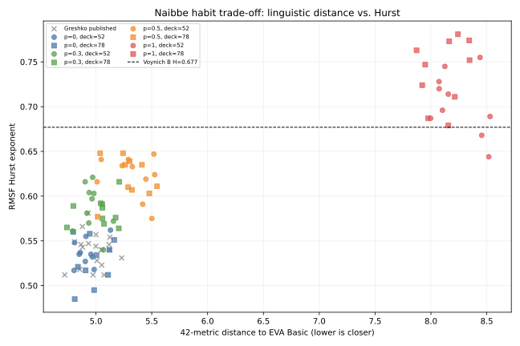
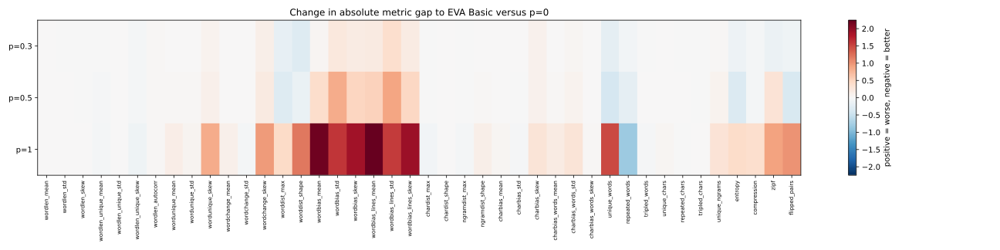

# Lokale Tabellenpräferenzen im Naibbe-Modell

**Stand** 13. Juli 2026

**Datengrundlage** 80 Modellläufe und 20 veröffentlichte Referenzläufe

## Kurzfassung

Die Naibbe-Chiffre bildet zahlreiche statistische Merkmale des
Voynich-Manuskripts nach, erreicht jedoch nicht dessen gemessene
langreichweitige Korrelationen. Greshko regt deshalb an, lokale Gewohnheiten bei
der Arbeit auf einzelnen Bifolia als möglichen Einfluss zu untersuchen
(Greshko 2025, Abschnitt 4.2). Der vorliegende Versuch setzt diesen Gedanken in
einem computationellen Modell um. Für jedes Bifolium wird eine bevorzugte
Substitutionstabelle festgelegt, die mit der Wahrscheinlichkeit `p_habit`
verwendet wird.

Untersucht wurden zehn Zufallsstartwerte, zwei Kartenstapel und vier
Ausprägungen von `p_habit`. Alle 80 Modellläufe beruhen auf demselben
Vier-Text-Komposit. Sie sind daher verschiedene Realisierungen eines festen
Versuchsaufbaus und keine unabhängigen Textkorpora. Als Vergleich dienen
zusätzlich 20 von Greshko veröffentlichte Naibbe-Läufe.

Damit die Veränderung des Hurst-Werts nicht isoliert betrachtet wird, fließen
außerdem 42 weitere Textmerkmale in die Auswertung ein. Sie werden zu einem
gemeinsamen Abstand gegenüber der Voynich-Transkription EVA Basic
zusammengeführt. Dieser Wert wird im Folgenden als 42D-Distanz bezeichnet. Ein
kleinerer Wert steht für ein insgesamt ähnlicheres Merkmalsprofil, ein größerer
Wert für eine stärkere Abweichung.

Mit steigendem `p_habit` nimmt der Hurst-Wert im verwendeten RMSF-Verfahren zu.
Bei `p=0,3` steigt er im Mittel von `0,532` auf `0,584`, während sich der
gemeinsame Abstand über 42 weitere Textmerkmale von `4,943` auf `5,003`
erhöht. Bei `p=0,5` erreicht Hurst `0,622`. Zugleich wächst der Abstand auf
`5,312`. Die Variante `p=1` liegt mit `H=0,722` über der
Currier-B-Referenz und weist mit `8,182` den größten Abstand in den übrigen
Merkmalen auf. Das Modell erzeugt somit unter den gewählten Bedingungen
langreichweitige Persistenz, verändert dabei aber auch andere Strukturen des
Chiffretexts.

## Forschungsfrage und Modell

Die Ausgangsüberlegung verbindet eine statistische Beobachtung mit der
Materialität des Codex. Ein Bifolium ist ein gefaltetes Doppelblatt, dessen vier
Seiten während der Herstellung räumlich zusammengehören. Nach dem Falten und
Binden erscheinen diese Seiten an unterschiedlichen Stellen der
Lesereihenfolge. Wenn eine verschlüsselnde Person ein Bifolium zusammenhängend
bearbeitet und dabei bestimmte Tabellen bevorzugt, könnte eine lokale
Gewohnheit im fertigen Codex als Beziehung über größere Textabstände sichtbar
werden.

Das Modell ist keine Rekonstruktion eines historischen Schreibvorgangs. Es
operationalisiert eine einzelne Annahme und macht deren Folgen messbar.
Untersucht wird, wie sich der erzeugte Chiffretext verändert, wenn für jedes
Bifolium eine Naibbe-Tabelle bevorzugt wird.

Der Parameter `p_habit` gibt an, wie wahrscheinlich diese bevorzugte Tabelle
bei einer regulären Tabellenwahl verwendet wird. Bei `p=0` bleibt sie
unberücksichtigt und jede Wahl folgt dem normalen Kartenstapel. Diese Variante
dient als Kontrolle. Bei `p=0,3` stammen im Mittel 30 Prozent der Wahlen von der
bevorzugten Tabelle, bei `p=0,5` sind bevorzugte Tabelle und Stapel gleich
wahrscheinlich. Bei `p=1` wird die bevorzugte Tabelle für jede reguläre Wahl
verwendet. Nur ein erneuter Versuch zur Vermeidung eines mehrdeutigen Bigramms
greift dann auf den Stapel zurück.

Ein höherer Wert bündelt die Verwendung derselben Tabelle innerhalb eines
Bifoliums. Da sowohl die bevorzugte Tabelle als auch die Stapelkarten nach den
ursprünglichen Naibbe-Gewichten gezogen werden, soll der Parameter vor allem
die lokale Verteilung verändern und nicht gezielt die globalen
Tabellenhäufigkeiten verschieben.

## Textgrundlage und Versuchsaufbau

Der Klartext entspricht Greshkos Vier-Text-Sampler. Er setzt sich aus jeweils
8.000 normalisierten Buchstaben aus Dantes *Divina Commedia*, Grossetestes *De
sphaera*, einem lateinischen alchemistischen Herbal und Plinius'
*Naturalis historia*, Buch 16, zusammen. Die vier Ausschnitte werden in dieser
Reihenfolge verbunden. Wortgrenzen, Satzzeichen und Großschreibung fehlen
bereits in der Vorlage, da Naibbe aus dem Buchstabenstrom eine neue Folge aus
Ein- und Zweibuchstaben-Gruppen erzeugt.

Das Modell ordnet jeweils 160 dieser Gruppen einer Seite zu. Vier Bifolia bilden
eine Lage mit 16 Seiten. Für jeden der Zufallsstartwerte 1 bis 10 wurden der
52- und der 78-Karten-Stapel sowie `p=0`, `p=0,3`, `p=0,5` und `p=1`
kombiniert. Auf diese Weise entstanden 80 Chiffretextläufe. Die vier
Habit-Varianten eines Zufallsstartwerts verwenden dieselbe zufällige
Klartextsegmentierung. Unterschiede zwischen ihnen lassen sich deshalb nicht
allein auf eine andere Ein- und Zweibuchstaben-Aufteilung zurückführen.

Die 20 veröffentlichten Naibbe-Läufe bilden eine zusätzliche Referenzgruppe.
Sie sind nicht mit den neu erzeugten Läufen gepaart. Der Vergleich mit ihnen
zeigt daher vor allem, ob die neue Kontrollgruppe in einem ähnlichen
Wertebereich liegt. Die eigentliche Untersuchung des Habit-Effekts erfolgt
innerhalb der gepaarten Modellläufe und bezieht jede Habit-Stufe auf `p=0` mit
demselben Zufallsstartwert und Kartenstapel.

## Auswertung

Die primäre Zielgröße ist der Hurst-Wert. Er fasst die Steigung der
RMSF-Kurve über 20 Fenstergrößen zusammen und dient hier als Kennwert für
langreichweitige Korrelationen. Mit derselben Binärkodierung und demselben
Fitverfahren liegt die Currier-B-Transkription bei `H=0,677`. Die Ergebnisse
sind an dieses konkrete Verfahren gebunden und werden nicht als allgemeine
Eigenschaft des Chiffretexts verstanden.

Als zweite Perspektive dienen 42 Metriken aus dem von Gaskell und Bowern
entwickelten und von Greshko übernommenen Auswertungsskript (Gaskell und
Bowern 2022). Sie erfassen unter anderem Tokenlängen, Wiederholungen,
Zeichen- und N-Gramm-Verteilungen, Entropie, Komprimierbarkeit und
positionsabhängige Verteilungen. Für jeden Chiffretext werden 100
zusammenhängende Ausschnitte mit mindestens 200 Token ausgewertet und
anschließend gemittelt. Diese Ausschnitte stabilisieren den Metrikwert eines
Laufs. Sie gelten nicht als 100 unabhängige Beobachtungen.

Zusammengenommen ergeben die 42 Messwerte für jeden Text ein Merkmalsprofil.
Die einzelnen Werte verwenden unterschiedliche Skalen und lassen sich deshalb
nicht unmittelbar miteinander vergleichen. Sie werden zunächst anhand von
Greshkos Vergleichskorpus standardisiert. Anschließend wird für jedes Merkmal
bestimmt, wie weit der untersuchte Text von „Voynichese - EVA Basic“ entfernt
liegt. Die 42 Abstände werden zu einem gemeinsamen Wert zusammengeführt. Die
Bezeichnung 42D verweist darauf, dass dieser Vergleich in einem Raum aus 42
Merkmalsdimensionen erfolgt.

Ein Text, der in allen 42 Merkmalen dieselben Werte wie EVA Basic aufwiese,
hätte eine Distanz von null. Je größer der Wert ausfällt, desto stärker weicht
das Merkmalsprofil insgesamt von dieser Referenz ab. Die Distanz besitzt keine
feste Obergrenze. Ihre Größenordnung lässt sich daher nur im Vergleich mit den
anderen Läufen derselben Auswertung interpretieren. Ein Anstieg um `0,060` ist
auch nicht als Zunahme um sechs Prozent zu lesen.

Die 42D-Distanz ergänzt den Hurst-Wert und zeigt, ob dessen Veränderung mit
einer Verschiebung der übrigen erfassten Textmerkmale einhergeht. Als
zusammenfassender Wert macht sie jedoch nicht sichtbar, welche einzelnen
Merkmale für den Abstand verantwortlich sind oder in welche Richtung sie sich
verändern. Sie ist auch kein allgemeines Maß für Sprachlichkeit oder
historische Plausibilität. Aus diesem Grund werden im Anschluss zusätzlich die
42 Einzelmetriken betrachtet.

Hurst und 42D-Distanz beziehen sich nicht auf genau dieselbe
Voynich-Teilauswahl. Der Hurst-Vergleich verwendet Currier B, während die
42D-Distanz auf EVA Basic für das gesamte Manuskript bezogen ist. Beide Werte
werden deshalb getrennt berichtet und nicht zu einem Gesamtindex verrechnet.

Die Untersuchung der 42 Einzelmetriken ist explorativ. Die angegebenen
Bootstrap-Intervalle sind nicht für multiples Testen korrigiert. Einzelne
Metriken werden daher nicht als eigenständige Nachweise interpretiert, sondern
dienen dazu, die Richtung der Veränderungen im Merkmalsraum zu beschreiben.

## Ergebnisse

### Langreichweitige Korrelation und gemeinsamer Merkmalsabstand

| Konfiguration | Läufe | Hurst, Mittelwert ± SD | 42D-Distanz zu EVA Basic, Mittelwert ± SD |
|---|---|---|---|
| Greshko, veröffentlichte Läufe | 20 | 0,539 ± 0,018 | 4,984 ± 0,125 |
| `p=0` | 20 | 0,532 ± 0,021 | 4,943 ± 0,116 |
| `p=0,3` | 20 | 0,584 ± 0,021 | 5,003 ± 0,134 |
| `p=0,5` | 20 | 0,622 ± 0,023 | 5,312 ± 0,175 |
| `p=1` | 20 | 0,722 ± 0,039 | 8,182 ± 0,200 |

Die neu erzeugte Kontrolle und Greshkos veröffentlichte Läufe liegen bei Hurst
und 42D-Distanz in einem ähnlichen Bereich. Daraus folgt nicht, dass beide
Gruppen in allen Merkmalen gleich sind. Der Vergleich zeigt jedoch, dass die
Kontrollgruppe bei den beiden zusammenfassenden Kennwerten keine grundlegende
Verschiebung gegenüber den veröffentlichten Naibbe-Läufen aufweist.

Innerhalb der gepaarten Modellläufe nimmt Hurst mit jedem untersuchten
`p_habit`-Wert zu. Bei `p=0,3` beträgt die mittlere Zunahme gegenüber der
Kontrolle `0,052`. Die 42D-Distanz nimmt um `0,060` zu. Bei `p=0,5` liegen die
entsprechenden Veränderungen bei `0,090` und `0,369`. Für `p=1` steigt Hurst um
`0,190`, während die Distanz um `3,240` zunimmt. Damit verläuft die Veränderung
des Hurst-Werts über die untersuchten Parameterwerte monoton. Zugleich wächst
der gemeinsame Abstand der übrigen Merkmale. Das Merkmalsprofil entfernt sich
also insgesamt von EVA Basic, auch wenn sich einzelne der 42 Merkmale der
Referenz annähern können.



Der Zusammenhang zeigt sich für `p=0,3` und `p=0,5` in beiden Kartenstapeln.
Bei `p=0,3` liegen die mittleren Hurst-Werte bei `0,587` im 52-Karten-Stapel und
`0,582` im 78-Karten-Stapel. Bei `p=0,5` betragen sie `0,622` und `0,621`. Erst
bei `p=1` fällt der Unterschied zwischen den Stapeln mit `0,705` und `0,739`
größer aus. Die 42D-Distanz bleibt für diese Variante in beiden Stapeln höher
als für die anderen Parameterwerte.

### Veränderungen der einzelnen Metriken

Für jede Metrik wurde geprüft, ob ihr standardisierter Abstand zu EVA Basic im
Vergleich mit der gepaarten Kontrolle ab- oder zunimmt. Bei `p=0,3` verringert
sich der Abstand bei 17 der 42 Metriken und erhöht sich bei 25. Bei `p=0,5`
liegen die entsprechenden Zahlen bei 14 und 28, bei `p=1` bei 9 und 33.

Bei `p=0,3` treten Abstandsabnahmen unter anderem bei der Form der
Worthäufigkeitsverteilung, der Zahl unterschiedlicher Token, dem Zipf-Maß, der
Entropie und den umgekehrten Tokenpaaren auf. Abstandszunahmen betreffen vor
allem positionsbezogene Verteilungsmaße. Bei `p=0,5` wird dieses Muster
ausgeprägter. Einige globale Merkmale bewegen sich weiterhin in Richtung EVA
Basic, während die positionsbezogenen Maße größere Abstände aufweisen. Bei
`p=1` gehören die sechs größten Abstandszunahmen vollständig zu diesen
Positionsmaßen.



Die zeilenbezogenen Metriken benötigen eine gesonderte Einordnung. Für den
Vergleich wurden alle Chiffretexte nach Greshkos Vorlage in künstliche Zeilen
mit zehn Token umgebrochen. Die Maße `wordbias_lines_*` beschreiben daher keine
historischen Manuskriptzeilen, sondern Zeilen der statistischen Aufbereitung.
Ihre Veränderung zeigt eine Verschiebung innerhalb dieses
Auswertungsformats. Sie erlaubt keine unmittelbare Aussage über die
Zeilenstruktur des Voynich-Manuskripts.

## Diskussion

Im untersuchten Versuchsaufbau geht die bifoliumgebundene Tabellenpräferenz
systematisch mit höheren Hurst-Werten einher. Dieser Zusammenhang zeigt sich
in allen 20 gepaarten Kombinationen aus Zufallsstartwert und Kartenstapel. Bei
`p=0,3` steigt der Mittelwert gegenüber der Kontrolle von `0,532` auf `0,584`,
bei `p=0,5` auf `0,622`. Die lokale Bündelung der Tabellenwahl verstärkt somit
jene langreichweitigen Korrelationen, die im ursprünglichen Naibbe-Modell
schwächer ausgeprägt sind als in Currier B.

Für die Interpretation ist entscheidend, dass bevorzugte Tabelle und
Kartenstapel aus derselben gewichteten Verteilung hervorgehen. Das Modell führt
also keine neuen Substitutionstabellen ein und verändert ihre globalen Anteile
nicht gezielt. Verändert wird ihre räumliche und zeitliche Verteilung. Eine
Tabelle wird innerhalb eines Bifoliums wiederholt verwendet, während die
zugehörigen Seiten in der Lesereihenfolge an verschiedenen Stellen erscheinen.
Der Anstieg des Hurst-Werts lässt sich vor diesem Hintergrund als Folge dieser
lokalen Bündelung verstehen. Die kodikologische Einheit des Bifoliums wird im
Modell auf diese Weise zu einer textstatistisch wirksamen Einheit.

Die Annäherung des Hurst-Werts an Currier B geht allerdings nicht mit einer
gleichförmigen Annäherung der übrigen Textmerkmale einher. Bei `p=0,3` nimmt
die 42D-Distanz gegenüber der Kontrolle um `0,060` zu. Hinter dieser geringen
Veränderung des Gesamtwertes stehen unterschiedliche Bewegungen der
Einzelmetriken. 17 Merkmale nähern sich EVA Basic an, 25 entfernen sich davon.
Ein annähernd stabiler Gesamtabstand darf deshalb nicht mit der Bewahrung aller
erfassten Eigenschaften gleichgesetzt werden.

Bei stärkerer Tabellenpräferenz tritt diese Verschiebung deutlicher hervor.
Mit `p=0,5` nähert sich der Hurst-Wert weiter an die Currier-B-Referenz an,
während die 42D-Distanz um `0,369` steigt. Bei `p=1` liegt der Hurst-Wert über
der Referenz und die Distanz nimmt um `3,240` zu. Einen wesentlichen Anteil an
dieser Entwicklung haben die positionsbezogenen Maße. Ihre Aussagekraft bleibt
hier begrenzt, da ein Teil von ihnen auf künstlich erzeugten
Zehn-Token-Zeilen beruht und nicht auf der überlieferten Zeilenstruktur des
Manuskripts.

Die Ergebnisse sprechen damit für einen spezifischen, aber begrenzten Befund.
Eine lokale Tabellenpräferenz kann innerhalb des Naibbe-Modells
langreichweitige Korrelationen erzeugen. Mit zunehmender Stärke dieser
Präferenz verändert sich jedoch zugleich das Profil weiterer Textmerkmale. Der
Hurst-Wert beschreibt daher keine allgemeine Annäherung an das
Voynich-Manuskript, sondern einen einzelnen Aspekt des erzeugten Chiffretexts.
Das Experiment weist eine bifoliumgebundene Gewohnheit als möglichen
Modellmechanismus aus. Rückschlüsse auf den historischen Herstellungsprozess
des Manuskripts lassen sich daraus nicht ableiten.

Für die weitere Untersuchung ist das Bifolium dennoch eine analytisch
produktive Einheit. Seine Einbindung macht sichtbar, wie eine Annahme über die
materielle Organisation eines Codex statistische Eigenschaften eines
generierten Textes beeinflussen kann. Ob der beobachtete Zusammenhang über den
verwendeten Vier-Text-Komposit hinaus Bestand hat, muss durch weitere
Klartexte, alternative Lagenmodelle und veränderte Seitenlängen geprüft werden.

## Grenzen

Die 80 Modellläufe beruhen auf einem festen Komposit aus vier Textausschnitten.
Weitere Klartexte und veränderte Reihenfolgen wären nötig, um zwischen einem
allgemeinen Habit-Effekt und Besonderheiten dieses Komposits unterscheiden zu
können. Zehn Zufallsstartwerte erlauben eine erste Einschätzung der Streuung,
bilden aber keine umfassende Sensitivitätsanalyse.

Das Seitenmodell bleibt regelmäßig. Es verwendet 160 Token pro Seite und vier
Bifolia pro Lage. Unterschiedlich lange Seiten, unregelmäßige Lagen, fehlende
Blätter und Ausfaltblätter werden nicht berücksichtigt. Auch die Dauer einer
lokalen Gewohnheit ist durch das Bifolium fest vorgegeben.

Der Hurst-Wert hängt von der verwendeten Binärkodierung, den Fenstergrößen und
dem Fitbereich ab. Die Aussagen gelten deshalb für das hier eingesetzte
RMSF-Verfahren. Die Einzelmetrik-Auswertung ist explorativ und enthält keine
Korrektur für multiples Testen. Hinzu kommt die künstliche Zeilenbildung, die
insbesondere die Interpretation der zeilenbezogenen Positionsmaße begrenzt.

Eine weitere Untersuchung sollte daher zusätzliche Textsampler, andere
Seitenlängen und mehrere Lagenmodelle einbeziehen. Für die
positionsabhängigen Metriken wären Vergleiche mit verschiedenen künstlichen
Zeilenlängen oder eine Auswertung ohne zeilenbezogene Maße erforderlich.

## Reproduzierbarkeit

Der vollständige Auswertungsablauf ist in `naibbe_habit_evaluate.py`
implementiert. Das historische Statistikskript von Gaskell und Bowern bleibt
unverändert. Die getrennte Ableitung `stats_habit.py` ergänzt einen festen
Zufallsstartwert und plattformunabhängige Ausgabepfade, ohne die 42
Metrikdefinitionen zu verändern. Klartextausschnitte, Prüfsummen,
Einzelergebnisse und Abbildungen liegen im Repository.

```bash
uv sync --extra eval
python -m unittest discover -s tests -v
uv run --extra eval naibbe-habit-evaluate
```

Der Standardlauf verwendet die Zufallsstartwerte 1 bis 10, beide Kartenstapel,
alle vier Habit-Stufen sowie Analyse- und Bootstrap-Startwert `2025`. Zwei
unabhängige reduzierte Wiederholungsläufe erzeugten byteidentische
CSV-Dateien.

Die vollständigen Ergebnisse sind in folgenden Dateien abgelegt.

- [Alle 100 Läufe und 42 Metriken](figure_utils/habit_evaluation/results/runs.csv)
- [Gruppenzusammenfassung](figure_utils/habit_evaluation/results/summary.csv)
- [Gepaarte Veränderungen der Einzelmetriken](figure_utils/habit_evaluation/results/metric_deltas.csv)
- [Rohe Metrikausgabe](figure_utils/habit_evaluation/results/metrics_raw.csv)
- [Hurst-Distanz-Diagramm](figure_utils/habit_evaluation/results/distance_hurst.svg)
- [Heatmap der Einzelmetriken](figure_utils/habit_evaluation/results/metric_deltas.svg)

## Literatur

Gaskell, Daniel E., und Claire L. Bowern. 2022. „Gibberish after all?
Voynichese is statistically similar to human-produced samples of meaningless
text.“ *CEUR Workshop Proceedings, International Conference on the Voynich
Manuscript 2022*, University of Malta.

Greshko, Michael A. 2025. „The Naibbe cipher: a substitution cipher that
encrypts Latin and Italian as Voynich Manuscript-like ciphertext.“
*Cryptologia*. <https://doi.org/10.1080/01611194.2025.2566408>.

Greshko, Michael A. 2025. *Supplementary materials for The Naibbe cipher*.
Zenodo. <https://doi.org/10.5281/zenodo.16415087>.
